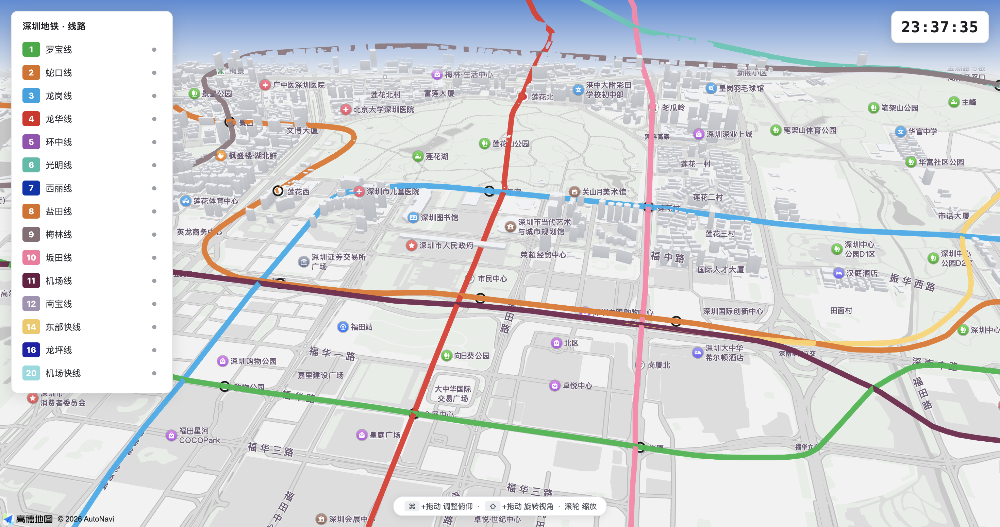

# Metro 3D · Shenzhen Metro

A real-time 3D digital map of the Shenzhen Metro, inspired by
[mini-tokyo-3d](https://minitokyo3d.com/). It simulates every train across the
network on top of AMap's 3D basemap, following real operating hours and
headways, running smoothly at 60fps.



## Features

- **Real-time clock** — the simulation follows real wall-clock time (1×);
  trains only run within each line's actual operating hours.
- **60fps animation** — trains and tracks render in a WebGL scene driven by
  `requestAnimationFrame`.
- **3D trains** — each train is drawn as extruded 3D cars that perspective-project,
  occlude, and shade correctly as you zoom and tilt.
- **Official line colours** — lines use the official Shenzhen Metro palette.
- **Interaction** — scroll to zoom, `⌘`+drag to tilt, `⇧`+drag to rotate;
  the side panel highlights and toggles lines.

## Quick start

Requires [pnpm](https://pnpm.io/) and an AMap *Web service* key.

```bash
pnpm install

# Configure the key
cp .env.example .env
#   set M3D_AMAP_KEY in .env (and M3D_AMAP_SECURITY_CODE if your account needs it)

pnpm dev          # build watch + local server (http://localhost:9001)
```

Other scripts:

```bash
pnpm build        # bundle to dist/
pnpm serve        # static server only (port 9001)
```

> You can also append `?key=YOUR_KEY` to the URL to test without rebuilding.

## License

MIT
